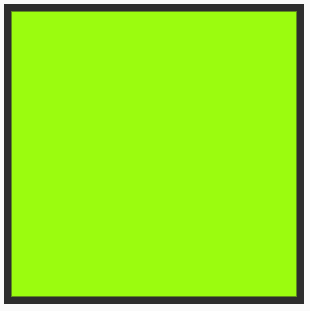

# pwon8301_9103_tut4

# Wk 8 Quiz
## Part 1: Imaging Technique

The inspiration 'Square Fill' comes from the Happycoding website. 

This is an animation idea which can be adapted where certain defined shapes can be gradually filled in with colour iteratively at different sizes. For example at a set colour and starting from small to progressively larger sizes, this can give the illusion of a shaped light pulsing or flickering on and off. In addition, with the manipulation of speed it can simulate how fast the light is pulsing.   

See below for chosen screenshots from the HappyCoding animation example to represent the idea of a square green light gradually coming on. 

## Part 2: Coding Technique

More text coming..

