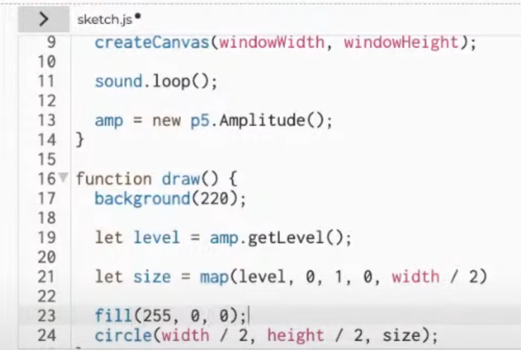

# pwon8301_9103_tut4

# Wk 8 Quiz
## Part 1: Imaging Technique

The inspiration 'Square Fill' comes from the Happycoding website. 

This is an animation idea which can be adapted where certain defined shapes can be gradually filled in with colour iteratively at different sizes. For example at a set colour and starting from small to progressively larger sizes, this can give the illusion of a shaped light pulsing or flickering on and off. In addition, with the manipulation of speed it can simulate how fast the light is pulsing.   

See below for chosen screenshots from the HappyCoding animation example to represent the idea of a square green light gradually coming on. 

## Part 2: Coding Technique

The inspiration is to use the p5.sound library to track the amplitudes of a sound file by frequency bands - Low, Mid, and High. 

Using shapes to represent the bands and p5.FFT, we can visualize the amount of energy/volume within these bands by having the shapes pulse in size accordingly with the sound.  

In a similar way, this section of example from Codeacademy uses p5.Amplitude to track overall amplitude of a sound file as it plays and uses a circle to represent it by changes in size. 

